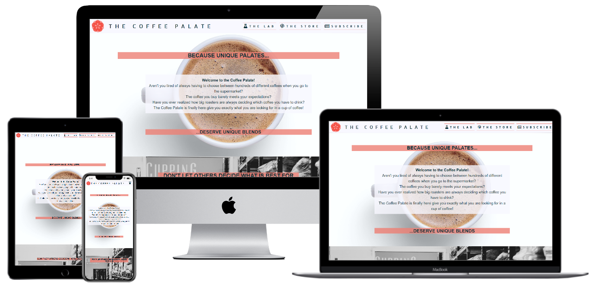
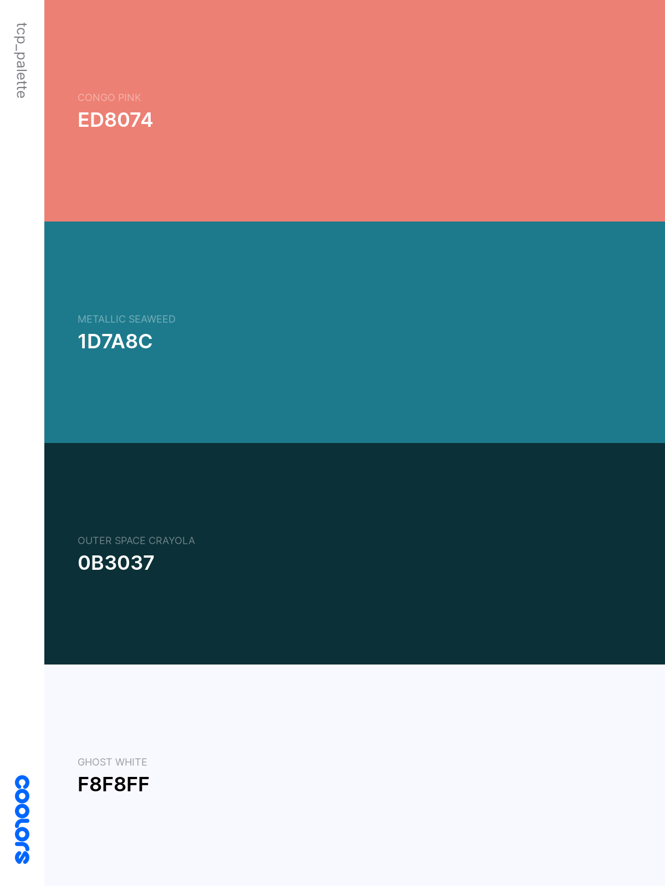

# **The Coffee Palate**

---

## **Project Goal** 

Welcome to the Coffee Palate!

Aren't you tired of always having to choose between hunderds of differents coffees when you go to the supermarket? Do you always end up choosing that kind of coffee that barely meet your preferences just because there is not enough information about it? Have you ever realized how big roasters are always deciding which coffee you must drink?
The Coffee Palate is finally here to give you exactly what you are looking for in a cup of coffee! 

You can finally stop complying with what big roasting companies think you need and adjust the coffee profile to your own specific palate.
If every person is different, why do we have to drink the same kind of coffee, right? Coffee by convenience is no longer what you need. You deserve you own unique blend!
Throughout this website you can learn about different coffee origins, learn about the roasting profiles and, finally, based on your brand-new acquired knowledge, develop your own exclusive blend. 
All of this, through an appealing, intuitive website with straight-forward and clear information.

Thank you for visiting my project and do not hesitate to contact me via GitHub if you have any doubts or concerns related to The Coffee Palate project.

---

## **Table of contents**

1. [UX](#ux)

    1.1 [User Goals and Stories](#user-goals-and-stories)

    1.2 [User Requirements and Expectations](#user-requirements-and-expectations)
    
    1.3 [Company Goals](#company-goals)
    
    1.4 [Design Choices](#design-choices)

2. [Wireframes](#wireframes)
 
    2.1 [Mobile](#mobile)
 
    2.2 [Tablet](#tablet)
 
    2.3 [Desktop](#desktop)
 
    2.4 [Changes throughout the coding](#changes-throughout-the-coding)

3. [Features](#features)
 
    3.1 [Existing Features](#existing-features)
 
    3.2 [Future Features](#future-features)

4. [Languages, Libraries, Frameworks and Tools](#languages-libraries-frameworks-and-tools)
 
    4.1 [Languages](#languages)
 
    4.2 [Libraries](#libraries)
 
    4.3 [Frameworks](#frameworks)
 
    4.4 [Tools](#tools)

5. [Testing and Debugging](#testing-and-debugging)
 
    5.1 [Ordering Process](#ordering-process)
 
    5.2 [Knowledge Acquired](#knowledge-acquired)
 
    5.3 [Navigation](#navigation)
 
    5.4 [Contacts and Social Links](#contacts-and-social-links)
 
    5.5 [Debugging](#debugging)

6. [Deployment](#deployment)

7. [Credits and Acknowledgments](#credits-and-acknowledgments)
 
    7.1 [Credits](#credits)
 
    7.2 [Acknowledgments](#acknowledgments)

---

## **UX**

---
[[Back to top]](#table-of-contents)

### **User Goals and Stories**

#### **Goals**
As a user I aim for:
* a simple and intuitive website,
* with value-added content,
* displayed over visual attractive pages,
* containing clear information on coffee and blending process,
* with several call-to-actions.

#### **Stories**
As a user, I want to:
* buy good quality and year-round consistent coffee.
* be able to select several origins to use in my blend.
* be able to learn more about coffee produced worldwide.
* get to know where my coffee comes from.
* understand about the different roasting profiles.
* access an intuitive website, easy to navigate.
* easily find the company contacts.
* easily find the company's social networks.

[[Back to top]](#table-of-contents)

### **User Requirements and Expectations**

#### **Requirements**
* Easy navigation.
* Interesting and pertinent content about coffee and blends.
* Clear pricing information.
* Good access points to contact the company.

#### **Expectations**

* Clear information about the steps to make my own blend.
* When clicking on links to external pages, I expect the new page to be opened in a separate browser tab.
* During the blending process, user wants to receive tips through "Tooltips".
* Reach out to the user's specific blend throughout no more than 4 steps.
* Strong connection with website visual effects.
* Links must be working properly to reach the target with any setbacks.
* Receive feedback after submitting my order through the form.

[[Back to top]](#table-of-contents)

### **Company Goals**

As the company owner, I want to:

* Establish the company online.
* Advertise the "make your own blend" as an innovative and unique service. 
* Attract customers to the ***art*** of blending.
* Promote different coffee origins.
* Educate the readers in regard to the different roasting profiles available.
* Convert webpage readers into potential customers.

[[Back to top]](#table-of-contents)

### **Design Choices**
As a coffee roaster specialized in blends, I tried to choose colors, both cold and warm, that work harmoniously, standing out the same effect expected on a blend from different origins and coffee with different profiles.

While trying to generate the business logo through [Tailor Brand](https://studio.tailorbrands.com/) I came across several appealing color schemes. Afterwards, I have transfered the most appealing one to [Coolors](https://coolors.co/) where, through slight adjustments, came up with a final, strong and harmounious scheme.

#### Fonts
Through [Tailor Brand](https://studio.tailorbrands.com/), I also got to know interesting font types. 

Afterwards, I have used [Google Fonts](https://fonts.google.com/ "Google Fonts") to try to replicate the ones found.

For the overall content I am using [Kumbh Sans](https://fonts.google.com/specimen/Kumbh+Sans?preview.text=unique&preview.text_type=custom&sidebar.open=true&selection.family=Kumbh+Sans) font. A font that is easily readable and visually attractive.

For the headings I have decided to go with [Allerta Stencil](https://fonts.google.com/specimen/Allerta+Stencil?preview.text=unique&preview.text_type=custom&sidebar.open=true&query=stencil) font, making the heading stand out from the general content and reflecting a characteristic from the roasting process: the cracks!

I trust that both typographies used blend very well with each other, creating a calm and inviting look to the website.

#### Icons
The icons that I will be using throughout my page are from [FontAwesome](https://fontawesome.com/ "FontAwesome").

The icons chosen are easy to understand and in line with the company branding , providing interest and supporting the navigation.

For instance, the navigation bar will collapse into a hambuger icon in mobile devices.

#### Colors

* congo-pink: #ed8074
The congo pink will be the color standing out the most as it will be used for the call-to-action buttons.

* metallic-seaweed: #1d7a8c;
The metallic-seaweed color will be and "aid" color. It will be used, if necesssary, to separate sections or highlight borders.

* outer-space-crayola: #0b3037;
This color will be the used throughout the website as the main text color. It has a great [contrast](https://coolors.co/contrast-checker/0b3037-f8f8ff) with the background.

* ghost-white: #f8f8ff;

The overall website will have a clean and fresh background, reason why I have opted by the Ghost White.
This particular color has a blue-purple accent that eases the transition to the three colors already mentioned.

In the creation of this palette, the [Contrast-Checker](https://coolors.co/contrast-checker/0b3037-f8f8ff) tool from [Coolors](https://coolors.co/ "Coolors") has been used in order to guarantee as good user readability. 

#### Structure

My website will be divided into 3 different pages.

##### Landing Page
The landing page is aimed to be visually attractive, with appealing images/icons that says "Welcome" by itself, unconsciously engaging the reader and creating curiosity to keep navigating throughout the page.

##### The Lab
The Lab is the educational part of the website where readers can come to learn more about the different coffee origins available and the several roasting profiles provided by the company.

##### Blending Store
The Blending store is the place where the magic happens. Here, the consumer can put into practice his/her new-found knowledge and create their own unique blend.

[[Back to top]](#table-of-contents)

---

## **Wireframes**

### **Mobile** ###
[Home](wireframes/home_sm.png)
[The Lab](wireframes/thelab_sm.png)
[The Store](wireframes/thestore_sm.png)

### **Tablet** ###
[Home](wireframes/home_md.png)
[The Lab](wireframes/thelab_md.png)
[The Store](wireframes/thestore_md.png)

### **Desktop** ###
[Home](wireframes/home_lg.png)
[The Lab](wireframes/thelab_lg.png)
[The Store](wireframes/thestore_lg.png)

### **Changes throughout the coding**

[[Back to top]](#table-of-contents)

---

## **Features**

[[Back to top]](#table-of-contents)

### **Existing Features**
#### ***Navigation bar***
For the navigation bar, I have used Bootstrap to implement a responsive navbar across devices. In this case, the navbar is 100% visable in large screens, while on small/medium devices it will collapse into a dropdown menu, resulting in space saving of the real-estate.

Moreover, the navbar will highlight the page where you are.

#### ***Landing page***
The landing page is displayed through 3 hero-images, each representing a separate section.

The first section gives an introductory paragraph about The Coffee Palate project.

On the following two sections, custom buttons were implemented to give the user another ossibility than the navbar tonavigate to the correspondingpages.

The last section is the subscriptioin section, which is implemented the same way across the pages.

#### ***The Lab***
The Lab page has been built following closely the design structure of the landing page. 

The introductory section uses a hero-image, whereas the following two section have implemented a carousel each. The page body ends at the subscription section.

Implementing the carousels with other content than pictures and make it responsive through devices has been quite a challenge, resulting in some trade-offs.

My first idea was to have fixed height carousels, but this resulted in a very complicated way to approach variable content. See [Debugging] section.

Therefore, I saw the need to restructure the carousels so they would work properly. For that I used Bootstrap grid to make the carousel adjust to the content and turn it into a fully responsive feature across devices.

#### ***The Store***
The store has a similar structure to the [The-Lab] page, whereas only one carousel is used instead of two.

On the same line as [The-Lab], this page also run into the same issues with the carousel. Insted of having variable content across slides (i.e text and graphs/diagrams) a form has been implemented.

Embeeding a form that has several steps, and consequently varies in height throughout the form itself, into a carousel was quite tricky.
To solve the responsiveness across devices, the solution passed by restructuring the carousel as explained in [Debugging] section.

[FontAwesome](https://fontawesome.com/ "FontAwesome") icons where used in the carousel title to visually also inform the user on which step he/she is in placing the order. 

#### ***Subscription***
The subscription section was an idea that came across through the actual coding and not idealized in the design process, result of missing some more intereactivity with the user.

Firstly, this section was implemented in the footer, but after discussing with my mentor and checking several other webpages, the decision was to implement it as an individual 
section to be used throughout the 3 html pages.

For this section I have used the Bootstrap flex grid.

#### ***Footer/Contacts***
The contact options are placed in the footer of the page, displaying social links and e-mail options, viat [FontAwesome](https://fontawesome.com/ "FontAwesome") for the user to get in contact with the company.

This is a simple and intutitive way of approaching it.

#### ***Modals***
Feeback to the user throughout the website and actions is fundamental. To address this user need, I have decided to implement modals linked to the "Subscribe" and "Place Order" buttons. 

[[Back to top]](#table-of-contents)

### **Future Features**
* Track&Trace for each order
* Personal profiles with history of user's purchases and blends
* Validation system to guarantee that user can only proceed from first slide on TheStore form after the blend totals 100%.
* Packaging customization form, where user uploads his/her own brand/logo to be applied on their coffee bags
* Imediate payment of the order through credit card, [Stripe](https://stripe.com/en-nl "Stripe") and [Paypal](https://www.paypal.com/nl/home "Paypal")
* Carousel on [TheLab] page with information on different brewing methods
* Updates Terms&Conditions under the [GDPR](https://gdpr-info.eu/ "GDPR") on how user data is used
* Implement an interactive shopping cart so the user can visualize in real-time his/her order and correspondant pricing
* User receive confirmation email after placing the order
* Tooltips on parts of the page where additional information might be required (i.e the type of grinding that is not covered on The Lab)

[Back to top](#ux)

---

## **Languages, Libraries, Frameworks and Tools**

[[Back to top]](#table-of-contents)

### **Languages**
* [HTML](https://www.w3.org/MarkUp/1995-archive/html-spec.html "HTML")
* [CSS](https://www.w3.org/Style/CSS/Overview.en.html "CSS")
* [Javascript](https://developer.mozilla.org/en-US/docs/Web/JavaScript "Javascript")

[[Back to top]](#table-of-contents)

### **Libraries**
* [FontAwesome](https://fontawesome.com/ "FontAwesome")
* [Google Fonts](https://fonts.google.com/ "Google Fonts")
* [Unsplash](https://unsplash.com/ "Unsplash)

[[Back to top]](#table-of-contents)

### **Frameworks**
* [Bootstrap](https://getbootstrap.com/ "Bootstrap")

[[Back to top]](#table-of-contents)

### **Tools**
* [Git](https://git-scm.com/ "Git")
* [Gitpod](https://gitpod.io/ "Gitpod")
* [Balsamiq](https://balsamiq.com/ "Balsamiq")
* [W3C-Markup-validation](https://validator.w3.org/ "Markup Validator")
* [W3C-Jigsaw](https://jigsaw.w3.org/css-validator/ "Jigsaw Validator")
* [W3C-Spell Checker](https://www.w3.org/2002/01/spellchecker "Spell Checker")
* [Google-Lightouse](https://developers.google.com/web/tools/lighthouse "Google Lighthouse") 
* [TinyPNG](https://tinypng.com/ "Tiny PNG")
* [Microsoft Excel](https://www.microsoft.com/en/microsoft-365/excel "Excel")
* [Contrast-Checker](https://coolors.co/contrast-checker "Contrast Checker")
* [Techsini](http://techsini.com/multi-mockup/ "Techsini")
* [Favicon](https://favicon.io/favicon-converter/ "Favcicon")

[Back to top](#ux)

---

[[Back to top]](#table-of-contents)

## **Testing and Debugging**

[[Back to top]](#table-of-contents)

### **Ordering Process**

#### **User Stories and Requirements** ####
* Buy good quality and year-round consistent coffee.
* Be able to select several origins to use in my blend.
* Clear information about the steps to make my own blend and reach out to the user's specific blend throughout no more than 4 steps.
* Receive feedback after submitting my order through the form.
* Clear pricing information.
* During the blending process, user wants to receive tips through "Tooltips".

##### **UX** #####
When user enters the store he/she must intuitively understand how to proceed with the purchase, receiving all relevant information to attain his/her unique blend.

##### **Execution** #####
To tackle these needs and requirements I have implemented a form within a carousel where, throughout well-defined 4 steps, the user starts by choosing the blend origins via dropdown lists with percentages. In doubt, the user can navigate back to *The Lab* to clarify any doubt or obtain any suggestions through the corresponding carousel, through the link placed there for that purpose.

The second step is to choose the roasting-degree. At this point the user can pick through radio buttons which kind he/she thinks will fit better with his/her preferences. As the previous step, the user can navigate back to *The Lab* via the link placed there for the purpose.

Third step passes by choosing the type of grind, together with the amounts needed. At this stage, the user is faced with the "pricing policy".

Fourth and final step of the order is a contact form with mandatory fields, where the invoice is to be sent.

After accepting *Terms&Conditions*, the user receivs immediate feedback provided with a modal that the order has been placed and which steps follow.

##### **Testing** #####

I have gone through the four steps of the order and found out that the pricing method displayed is not sufficient clear.
Also, as we are in a middle of a form and don't want to loose the data inserted so far, by clicking on the link back to *The Lab*, this was opening in the same tab which was afecting the user experience. Thereof, target="_blank" attribute has been included in the corresponding anchor element.

##### **Test result** #####

The order testing clearly passes 4 out of 6 stories and requirements. 
The first topic to address in future releases would be the tooltips, that due to time constraints I was not able to implement in due course. Using Bootstrap tooltips might be the fastest option to guarantee compatibility and responsivness with the rest of the website.
The second and final topic to tackle in future releases would be the clear pricing information, for which I would have to use deeper developing languages, like Javascript, and at the moment I don't have the knowledge to implement an interactive shopping cart so the user can visualize in real-time his/her order and correspondant pricing.
 
##### **Conclusion** #####
The test passes 67% of the stories and requirements and works as planned.
The remaining 33% (clear price information and tooltips) are still to be implemented due to lack of time and knowledge.

[[Back to top]](#table-of-contents)

### **Knowledge acquired**
#### **User Stories and Requirements** ####
* Be able to learn more about coffee produced worldwide and get to know where my coffee comes from.
* Understand about the different roasting profiles.
* Interesting and pertinent content about coffee and blends.

##### **UX** #####
When user navigates to *The Lab*, he must infer automatically where the info he/she is looking for is.

##### **Execution** #####
To display the learning content on *The Lab* page, I have implemented two separate carousels. One for the coffee origins and another for the roasting profiles.
Has both carousels present only 5 items each, using this option is appropriate. If there were a lot more items, most probbaly I would have to re-think the full content display on the page.

On the first carousel, user can know where the coffee comes from. As The Coffee Palate only provides standard coffee, a general briefing of the coffee sector per country is sufficient.

The roasting process is quite complex, the reason why I have opted to present through a diagram the range of acidity/bitterness that the coffee undergoes whilst roasting. For the common mortal, this information is more than enough to understand which degree to choose for his/her blend.

Morover, whilst the first carousel presents fun facts about the origin to make the content more appealing, the second carousel presents *tips* instead. This because the choosing process is more complex during this stage than choosing the favourite origin based on the radial graphs presented.

##### **Testing** #####
Entered *The Lab* page and scrolled down to the origins carousel. The info presented is clear, appealing, easy to understand and easy to compare between origins.

Moved to the second carousel. Info is clear and self-explanatory.

##### **Test result** #####
Carousels are working properly and all the info is passed withou any issue to the user.

##### **Conclusion** #####
The test passes all the criteria.

[[Back to top]](#table-of-contents)

### **Navigation**
#### **User Stories and Requirements** ####
* Access an intuitive website, easy to navigate.
* Strong connection with website visual effects.
* Links must be working properly to reach the target without any setbacks.

##### **UX** #####
* Landing Page

When the user enters the landing page, he/she is confronted with a clear and intuitive website.

Throughout the navigation bar / dropdown menu (triggered by the "coffee mug icon"), the user can access the 2 main sections: *The Lab* and *The Store*.
Also, the user has always available the option to navigate to the *Subscribe* section, either via the navbar/dropdown menu or scrolling to the bottom of the page.

Moreover, on big screens the user can know on each section of the page he/she highlighting the specific section

On top of this, the user is confronted with 3 impactful hero-images, where the last 2 display 1 button each to navigate to the corresponding page.

Reaching the bottom of the page, the user can visually identify the points of contact with the company.

* The Lab

When user get to *The Lab* it is confronted with the same structure, creating a feeling of harmony during the navigation.

At this stage, user is faced with 2 carousels displaying useful information for the blending process. These present a very easy, intutitve and appealing way to navigate through the info.

At this point user can navigate directly to *The Store* through a button placed below the two carousels. 

* The store
When the user reaches this point he/she already understands the structure of the page and can now fully focus on the blending process.

For the blending process, users faces a form within a carousel where, within 4 steps, he/she can place his/her order.

* Modals
Modals presented when subscribing to the newsletter and placing the order through the "Let's Blend" button, give an immediate feedback to the user that is action is now being taken care of. 

##### **Execution** #####
* Nabvar

For the sake of ease of navigation, I have implemented through Bootstrap a toggle menu for medium and small devices.

The user can also know on each section he/she is due to the pseud-class:active that gives that specific section on the navbar a fixed color. This does not apply to the subscription link as it is transversal to all the pages, sending the user to the bottom of each of the pages.

* Hero-images
The hero-containers applied via Bootstrap included a min-heigh of 60vh in the backgound-images giving the user a sneak-peek of what comes below when the content does not exceed this height.
As the content is of extreme importance, this sneak-peek stops applying if necessary.

* Carousels
The carousels implemented to show the content and the form, together with d-flex and h-100 bootstrap classes guarantees that the they are fully responsive across devices.

* Forms
To embeed the form in the carousel, I have opened it righ at the beginning of the carousel and closed right before the end. The formating was made with Bootstrap guaranteeing its responsivness.

* Overwriting
I have used Bootstrap throughout all the website, but to guarantee the customization of the page, I overwrote some classes with CSS.

##### **Testing** #####
To test the navigation, I have conducted a thourough analysis going page by page and clicking on any button available to gurantee that there is nothing not functioning properly.
Started with the navbar in small-devices up to big-screens, analysed in-between pages buttons and carousel and modals buttons, finishing with the anchor elements at the footer of the pages.

##### **Test result** #####
Website does not show any contradictory information, has a well-defined structure and and is easy to navigate.

Colors and images bring a perfect identity to every step/location where the user is navigating. 

External links are internal *The Lab* links within the carousel form, open in a new tab to guarantee that the user does not loose track of what he/she is doing, nor information already inputed in the form.

##### **Conclusion** #####
Test matches fully the user requirements and passes all the criteria

[[Back to top]](#table-of-contents)

### **Contacts and Social Links**
#### **User Stories and Requirements** ####
* Easily find the company contacts and social networks.
* When clicking on links to external pages, I expect the new page to be opened in a separate browser tab.
* Good access points to contact the company.

##### **UX** #####
##### **Execution** #####
The website uses what is currently accepted to place the contact information: the footer.

Being the visual identity very important when navigating through a website, I have decided to display the contacts only through self-explanatory icons.

All links are to be opened in a blank tab.

##### **Testing** #####
To test this, I have runned a thourough inspection of the footer element, clicking link by link to guarantee its workability as desired.

##### **Test result** #####
All links are working properly and opening either on a new tab or on the corresponding app on mobile devices.

##### **Conclusion** #####
Test fully matches the user requirements and address the user stories, passing all the criteria.

[[Back to top]](#table-of-contents)

### **Debugging**
#### **Known Bugs and Corrections** ####

##### **Bug** #####
horizontal scroll-bar displaying on mobile
##### **(Potential) Corrections** #####
Footer content was not contained in a container, originating it to exceed the admissible width.
Containing the content into a container-fluid solved the issue.

##### **Bug** #####
a:hover color seaweed not displaying properly on mobile and showing text-decoration
##### **(Potential) Corrections** #####
a:hover color was within the media query for big screens.
Moving this element styling to the top of the CSS below the main a element solved the issue.

##### **Bug** #####
Dropdown menu not colapsing automatically when choosing the subscribe option
##### **(Potential) Corrections** #####
At the moment I don't have the necessary skills to solve this bug, but certainly this is possible to correct with some Javascript

##### **Bug** #####
Modals not centered
##### **(Potential) Corrections** #####
Modals where not being displayed centered has the width of the modal class was set to 90%.
Changing it to 100% solved the bug.

##### **Bug** #####
User can proceed through the first and third step of the order form without selecting the percentages of coffee for the blend and without selecting the amount of bags/amount of coffee er bag.
##### **(Potential) Corrections** #####
In the future I would like impplement some validation code on this steps to prevente the user of proceeding forward without filling this content.
For instance, if the total ofthe blend does not equal 100%, the user will not be able to go to step 2.
On the same line, the user will have to tick the box of the desired grind in order to be able to choose the amount of bags/amount of coffee per bag. User will only proceed if input fields linked 
with the checkbox selected are duly filled.
To minimize the impact of this issue, I have chosen to place clear warnings/advices throughout the form.

[[Back to top]](#table-of-contents)

---

## **Deployment**

The Coffee Palate project has been deployed via GitHub after its final push.

These are the deployment steps:

* 1 - Go to settings within the corresponding repository in GitHub
* 2 - Enter the Source section within the Pages section
* 3 - Choose the correspondant master branch on the GitHub Pages section and click save

The page is now live on https://arturmpinho.github.io/thecoffeepalate/

The page updates automatically after commit and push to Github any potential change.

[[Back to top]](#table-of-contents)

---

## **Credits and Acknowledgments**

[[Back to top]](#table-of-contents)

### **Credits**
#### **Media**
You can find all the images sources through the collection prepared [here](https://unsplash.com/collections/61301103/the-coffee-palate "Unsplash").

*Sidenote*: Graphs and diagrams are own-creation.

#### **Content**
##### **Fun Facts:** #####
https://www.cecafe.com.br/en/about-coffee/interesting-facts/

https://www.cafedecolombia.com/particulares/historia-del-cafe-de-colombia/

https://jporganiccoffee.com/blogs/news/10-interesting-facts-about-kenya

https://www.backyardtravel.com/blog/8-things-to-know-about-vietnamese-coffee/

https://www.ethiobeauty.com/article/interesting-facts-about-ethiopian-coffee

##### **Coffee descriptions** #####
https://coffeeattendant.com/2018/04/24/these-are-the-coffee-flavors-by-country/

https://www.sucafina.com/emea/origins/vietnam?price=EUR

[[Back to top]](#table-of-contents)

### **Acknowledgments**
To accomplish this website I have used some content from [Stackoverflow](https://stackoverflow.com/questions "Stackoverflow") community, to whom I would like to thank for all the suggestions and content made publicly available.

Also, some parts of the code have been based on the content available in [W3Schools](https://www.w3schools.com/ "W3Schools") and [Bootstrap](https://getbootstrap.com/ "Bootstrap") that allowed me attain the final result.

All software and applications used to create this website are mentioned above in section [Languages_Libraries_Frameworks_and_Tools].

A big thank you to my mentor, [Anna_Villanueva](https://github.com/annavillanueva "Anna Villanueva Github page"), for all the inputs and guidance throughout the past months.

To my friends and familiy that took time to test and re-test the website and for their valuable recommendations.

Last but for sure not the least, a special thanks to my wife-to-be, Anouk, for all the suggestions, inputs, testing and above all for the extreme patience and support shown during this journey.

Thank you all!

[[Back to top]](#table-of-contents)